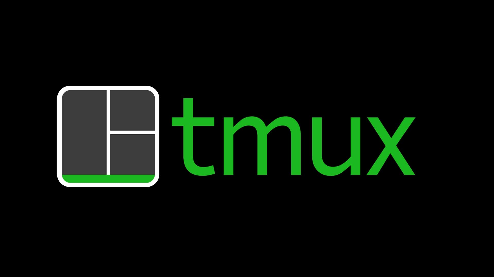

# TMux

    

TMux stands for Terminal Multiplexer, it is a useful package for manage different session of your terminal using few 
commands. Managing multiple session of terminal is useful in developing daily work. Think about running Angular dev
server, while developing backend. If you accidentally close the terminal, the process is still working and you do not lose
you progress.

Tmux works with concept of sessions and tabs. When you type `tmux` a new session will be created, with a single tab. You
can attach new tab to the current session, and moving around these tabs to see what is happening.

Useful commands in this customization are:

* `Ctrl` + `s` + `c` attach a new tab to the current session.
* `Shift` + left or right arrow to navigate through your tabs.
* `Ctrl` + `x` kills the current pane.
* `Ctrl` + `X` kills the entire session.
* `Ctrl` + `R` rename the current tab.
* `Ctrl` + `r` reload the configuration.
* `Ctrl` + `h` splits horizontally the current tab.
* `Ctrl` + `v` splits vertically the current tab.
* `Alt` + left or right arrow able to navigate through different terminal in the current tab.

